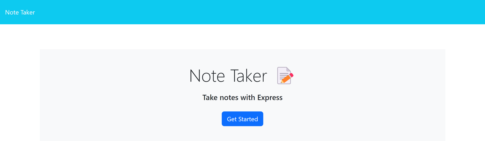
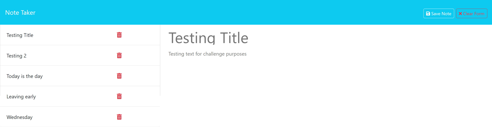

# Note Taker Application

## Table Of Contents 
- [Note Taker Application](#note-taker-application)
  - [Table Of Contents](#table-of-contents)
  - [Description](#description)
  - [Screenshots](#screenshots)
  - [Technologies Used](#technologies-used)
  - [Installation](#installation)
  - [Features](#features)
  - [Testing](#testing)
  - [License](#license)
  - [Questions](#questions)
  - [Contributions](#contributions)
  
## Description 
This Note Taker applications allows users to create, view and delete notes. It's built with Node.js and Express.js for the backend, and uses Bootstrap and vanilla Javascript for the front end.

## Screenshots

## Technologies Used
The Technologies used in the app:
* Node.js 
* Express.js
* Javascript(Frontend)
* Bootsrap
* Font Awesome
* UUID
* Fetch API
  
## Installation 

1. Clone the repo: git@github.com:EdRivera016/Note-Taker.git
2. Install dependencies: npm install.
3. Start Server with npm start or node server.js.
4. Click on http://localhost:3001

## Features
This Note Taker application allows users to easily create and save notes with both a title and text. USers can view a list of all their saved notes and can delete any note they no longer need. Additionally, the apllication features a responsive design, ensuring it works seamlessly across all device sizes

## Testing 
To test the application:
1. Open your web browser and navigate to http://localhost:3001.
2. Click "Get Started" to access the notes page.
3. Create a new note by entering a title and text, then click the save button.
4. Verify that the note appears in the sidebar.
5. Click on a note in the sidebar to view its details.
6. Delete a note by clicking the delete icon next to it.

## License 
NOTICE: This application is covered under the MIT License.

## Questions 
Please send any quesons you may have [here](mailto:edwinrivera016@outlook.com?subject=[Github]%20Dev%20Connect) or visit [github/EdRivera016](https://github.comEdRivera016).

## Contributions
- Starter code provided by UCF: git@github.com:coding-boot-camp/miniature-eureka.git
